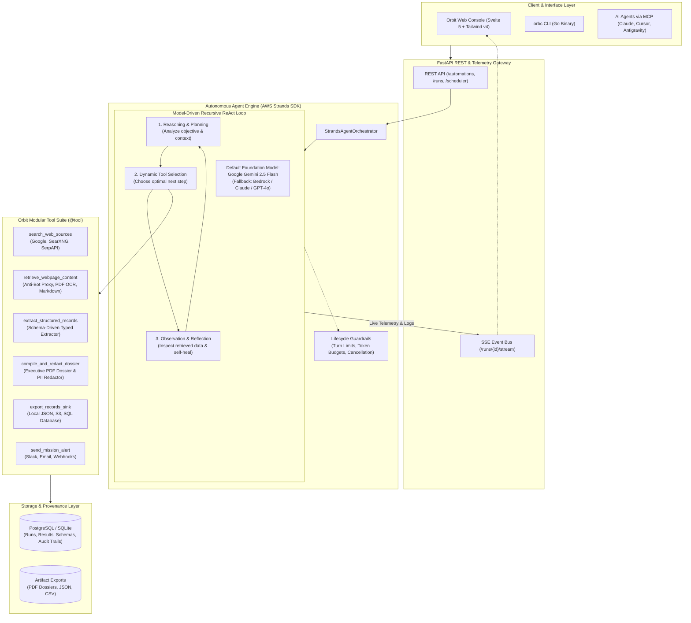

# Orbit

**Autonomous Goal-Driven Web Data Operations Platform**

> *"Set the goal. Walk away."*

[](LICENSE)
[](cli/)
[](core/)
[](app/)

Orbit is an autonomous web data operations and extraction platform designed for **data engineers, quantitative analysts, and AI/LLM engineering teams**. Instead of hand-crafting fragile web scrapers, reverse-engineering dynamic DOM selectors, managing proxy rotation pools, or repairing constant schema drift, you define data extraction objectives in natural language.

Orbit synthesizes execution plans, derives typed JSON schemas, discovers authoritative web sources, navigates resilient proxy infrastructure, extracts typed records, performs statistical anomaly and schema verification, evaluates condition triggers, and runs on scheduled intervals with complete, immutable data provenance.

---

## Core Capabilities

- **Natural-Language Objective Compilation**: Translate high-level data requirements into structured execution plans, search vectors, typed extraction schemas, and Cron schedules automatically.
- **Dynamic Typed Schema Derivation**: Automatically infers strongly typed JSON schemas with validation rules, enum constraints, and field requirements tailored to the target domain without manual selector maintenance.
- **Multi-Source Discovery & Resilient Retrieval**: Combines search APIs, domain discovery heuristics, and anti-bot unlocker proxies to retrieve dynamic, JavaScript-rendered web content reliably.
- **Agentic Self-Healing & Adaptive Recovery**: When page layouts change or initial queries yield empty sets, the Agent Brain autonomously diagnoses failure modes, adjusts search parameters, and re-executes retrieval paths.
- **Data Quality Verification & Anomaly Detection**: Validates extracted datasets against derived schemas and checks for statistical outliers, structural anomalies, and null invariants before downstream ingestion.
- **Condition Triggers & Webhook Alerts**: Evaluates scalar and aggregate expressions (e.g., `min(price_per_hour) < 2.50` or `rate_change_percent >= 5.0`) and dispatches structured event payloads to downstream webhooks and notification channels.
- **Persistent Scheduling Daemon**: Built-in background scheduling engine supporting recurring intervals (`hourly`, `daily`, `weekly`, `monthly`, custom Cron) with concurrency control and state persistence.
- **End-to-End Lineage & Provenance DAG**: Audits every stage of execution—from discovery queries and HTTP response headers to raw DOM snapshots, LLM reasoning traces, and verification logs.

---

## System Architecture

Orbit is architected as a modular data platform consisting of an autonomous execution engine powered by the **AWS Strands Agents SDK**, a single-binary operator CLI, a mission control web dashboard, and extensible protocol adapters:



---

## Repository Structure

The Orbit repository is structured as a monorepo:

| Component | Directory | Description | Documentation |
|---|---|---|---|
| **Core Engine** | [`core/`](./core) | Python backend daemon: Agent Orchestrator, LLM pipeline, APScheduler, PostgreSQL, Redis, Pub/Sub and FastAPI REST API. | [Core Documentation](./core/README.md) |
| **Web Console** | [`app/`](./app) | Operational telemetry console built with SvelteKit, Tailwind CSS v4 | [App Documentation](./app/README.md) |
| **Operator CLI (`orbc`)** | [`cli/`](./cli) | High-performance Go CLI for headless operations, pipeline triggers, dataset exports, and telemetry inspection. | [CLI Documentation](./cli/README.md) |
| **MCP Server** | [`mcp/`](./mcp) | Model Context Protocol adapter enabling AI agents (Claude, Cursor, Antigravity, VS Code) to orchestrate Orbit. | [MCP Documentation](./mcp/README.md) |

---

## Quickstart

### 1. Launch the Orbit Core Daemon

Follow the [Core Setup Guide](./core/README.md) to start the backend daemon:

```bash
# 1. Navigate to core and configure environment
cd core
cp .env.example .env  # Windows: Copy-Item .env.example .env

# 2. Initialize virtual environment and start Core
python -m venv venv
source venv/bin/activate  # Windows: .\venv\Scripts\Activate.ps1
pip install -e ".[dev]"
uvicorn app:app --host 0.0.0.0 --port 8000
```

### 2. Launch the Web Console

```bash
cd app
pnpm install
pnpm dev
```

The operator console will be available at `http://localhost:5173`.

### 3. Install and Use the `orbc` CLI

```bash
# Build the CLI
cd cli
make build

# Synthesize and register an autonomous mission
orbc goal "Daily at 6 AM, monitor pricing, SKU availability, and inventory changes across top 5 enterprise cloud hardware vendors"

# Trigger an immediate pipeline run
orbc run <automation_id>

# Export validated structured records to CSV or JSON
orbc data <run_id> --format table
orbc data <run_id> --format csv > cloud_hardware_pricing.csv
orbc data <run_id> --format json --valid-only | jq .

# Inspect full provenance DAG and verification audit logs
orbc show <run_id>
```

---

## Production Workflows & Use Cases

| Operational Domain | Objective Specification |
|---|---|
| **Enterprise Cloud & Hardware Telemetry** | `"Daily at 6 AM, monitor pricing, SKU availability, and GPU instance specs across top 5 cloud infrastructure providers and alert if H100 spot rate < $2.80/hr"` |
| **Regulatory & Energy Compliance** | `"Every 4 hours, scan regional energy regulatory portals for policy updates on renewable grid tariffs and extract structured docket numbers, filing dates, and rate adjustments"` |
| **AI Research & Ingestion Pipelines** | `"Daily at midnight, extract and structure AI research preprints mentioning sparse attention architectures with author affiliations, dataset links, and benchmark claims"` |
| **Compensation & Labor Market Analytics** | `"Weekly on Monday, aggregate median tech compensation bands, level distributions, and hiring volume across Tier 1 fintechs and export structured records"` |
| **Competitive SaaS Pricing Matrices** | `"Weekly, scan enterprise security vendor pricing pages, extract tier limits, add-on costs, and seat minimums into a unified schema"` |

---

## License

This project is licensed under the MIT License — see the [LICENSE](LICENSE) file for details.
